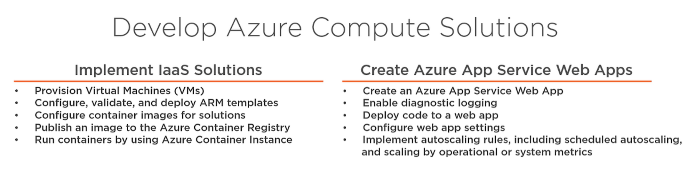
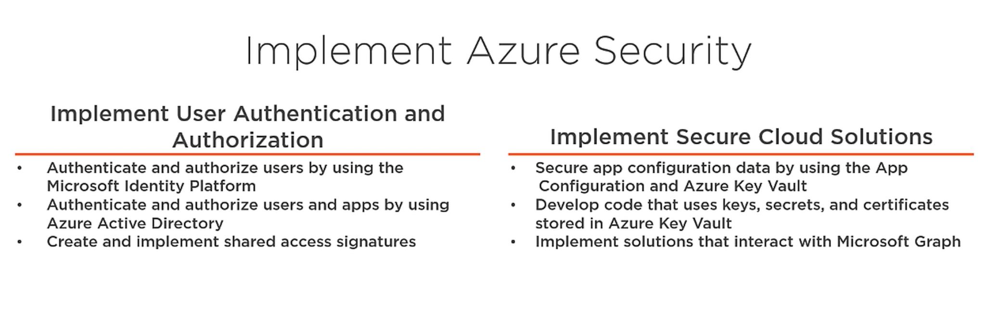

## Skills Measured
The AZ-204 exam covers the following domains:

Develop Azure compute solutions (25-30%)
Develop for Azure storage (10-15%)
Implement Azure security (15-20%)
Monitor, troubleshoot, and optimize Azure solutions (10-15%)
Connect to and consume Azure services and third-party services (25-30%)



### Create Azure VM through Azure CLI
```
az group create \
    -- name "test-group" \
    -- location "centralus"

az vm create \
    -- resource-group "test-group" \
    -- name "test-vm-win" \
    -- image "win2019datacentre" \
    -- admin-username "demo"
    -- admin-password "demo1234"

az vm create \
    -- resource-group "test-group" \
    -- name "test-vm-linux" \
    -- image "UbunutLTS" \
    -- admin-username "demo" \
    -- authentication-type "ssh" \
    -- ssh-key-value ~/.ssh/id_rsa.pub
```

### Enabling remote access with Azure CLI
```
az vm open-port \
    --resource-group "test-group" \
    --name "test-vm-win" \
    --port "3389"

az vm open-port \
    --resource-group "test-group" \
    --name "test-vm-linux" \
    --port "22"
```

### List the IP address assosciated with VM
```
az vm list-ip-addresses \
    --resource-group "test-group" \
    --name "test-vm-linux"
    --output table
```

### Log in to the Linux VM
```
ssh demo@<PUBLIC_IP>
```

### Cleanup the resources in the demo
```
az group delete --name "test-group"
```

## ARM Templates
JSON resource file, Building blocks for deployment automation. Templates are submitted to ARM for provisionning 
We can Export ARM templates from Azure Portal
ARM Templates can be deployed using Azure Portal, Azure CLI, Powershell, REST API, Azure Cloud Shell


